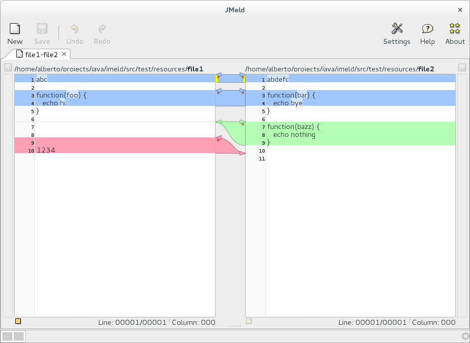
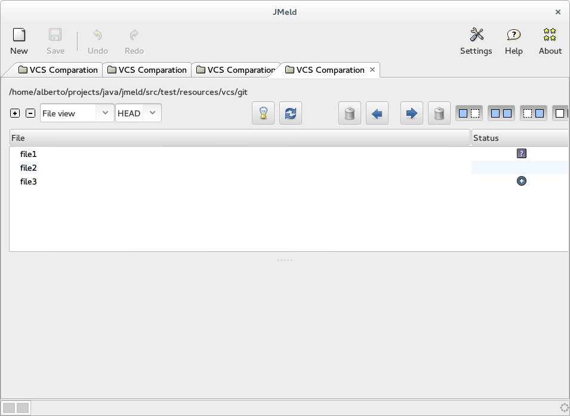
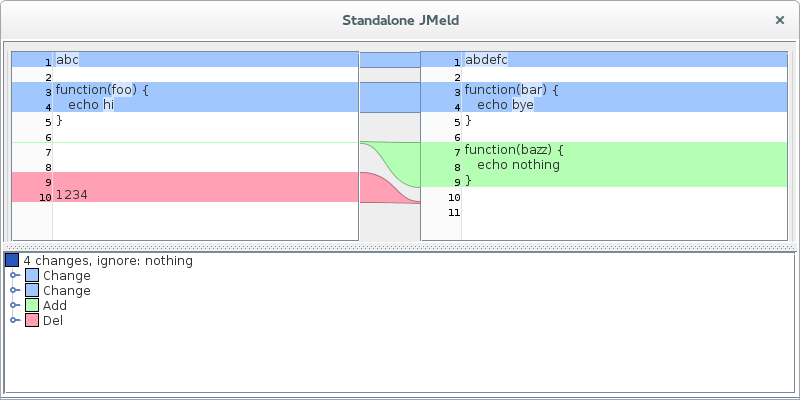

# JMeld

A visual diff and merge tool. It is build to be fast with large files and runs on any operating system.

This is how it looks like:

VCS Comparation

And here is a isolate diff component

## Background

This repo comes from a svn migration to git from [jmeld](http://keeskuip.home.xs4all.nl/jmeld/) which in fact, is modelled after the fantastic program [meld](http://meldmerge.org)

## Compilation

JMeld can be compiled with the command:

    $ ant

or with maven

    $ mvn clean install

## Usage

Start jmeld with the command:

    $ java -jar JMeld.jar <file1> <file2>

or use [mvnexec](https://github.com/albfan/mvnexec)

    $ mvnexec -Pqaf jmeld.JMeld
    $ mvnexec -BCDPqaf jmeld.JMeld src/test/resources/file{1,2}
    $ mvnexec -BCDPqaf component src/test/resources/file{1,2} 

> trust me, that commands works out-of-the-box

## License

This license of this program is the LGPL.

## Credits

> Nice to see JMeld survive. I hope you get as much pleasure (and knowledge) as I got from working with JMeld.
> Kees Kuip
